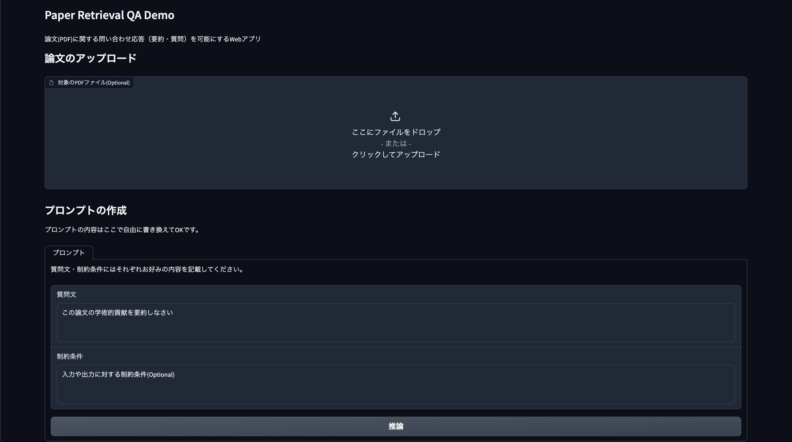

<div align="center">

# Paper Retrive QA

</div>

論文に関する問い合わせ応答（要約・質問）を可能にするWebアプリ

## DEMO

以下のコードでデモを実行できる

```sh
$ python3 demo.py
```



## Feature

### 本プロダクトはchatGPTの以下の３つ課題を解決する

1. 最新論文への対応
2. プロンプトのトークン制約
3. pdfパーサーの不安定性（数式記号や表を含むpdfを上手くtext化できない）

### アーキテクチャ

アップロードされた論文pdfファイルを英語の論文解析に特化した機械学習ベースOCR`nougat-ocr`でmmdファイルに変換し、特定のヘッダーレベルで分割、ベクトル埋め込みをベクトルDBにストアする。ユーザの質問に関して、ベクトルDBにクエリ検索を行い、関連した情報を取得して答えを返す。

:::mermaid
flowchart
    subgraph user  

        subgraph input
            Q[Question]
            S[PDF]
        end
        subgraph output
            A[Answer]
        end
        input --> output
    end
        subgraph inside
        S-->*.PDF
        Q---LLM
        LLM---A
        LLM{{LLM}} -.-> query
        D[/vectorDBstore/] -.-> LLM
        query -. similarity search .-> D[/vectorDBstore/]
        *.PDF -- nougat ocr -->*.mmd
        *.mmd -- texsplitter --> chunk
        chunk -- OpenAIEmbeddings-->D[/vectorDBstore/]

        end

:::

### ヘッダー分割により期待される効果

- 特定のセクションやチャプターに直接アクセスしやすくなること
- ユーザーの検索意図をより正確に反映させ、関連するセクションやトピックを提供すること
- ヘッダーレベルによる分割により、文書がより整理されること

## Installation

Githubからこのリポジトリをクローンする

```sh
$ git clone https://github.com/t-na10/PaperRetriveQA
$ cd PaperRetriveQA
```

## Setting up Python Environment

以下のコードを実行して、Python環境を構築する

```sh
conda create --name <env_name> python=3.10.10 --file requirements.txt
```

## Usage

### Webアプリ

.envファイルを作成し、以下のようにOPENAI_API_KEYを入力し保存する

```txt
OPENAI_API_KEY='ここにAPIキーを挿入してください'
```

以下のコードを実行する

```sh
$ python3 demo.py
```

URLをコピペして、ブラウザで開く

## Note

### 今後の展望

- MultiQueryRetrieverの検証
- チャンクサイズの細分化
- chatbot化

## License

MIT
